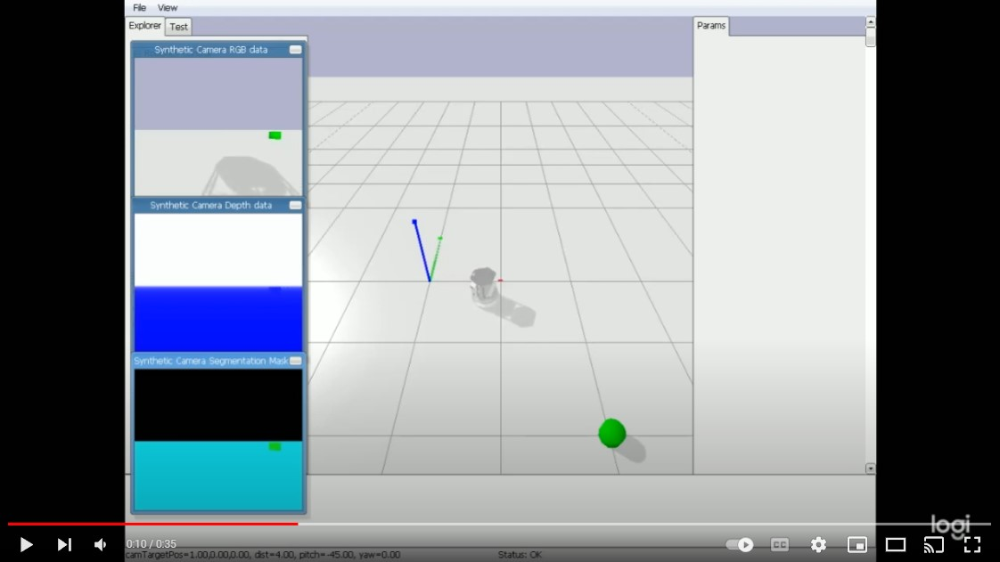

# Turtlebot RL Controller
In this project, I set up a virtual environment using PyBullet to train the Turtlebot to discover and approach a green target through Q-learning.

The observation is based on the camera images, and the control signals are the left and right wheel speed. 

The reward is based on whether the target is centered in the image, and also proportional to the size of the target. 

The demo for the trained controller can be found below. 

